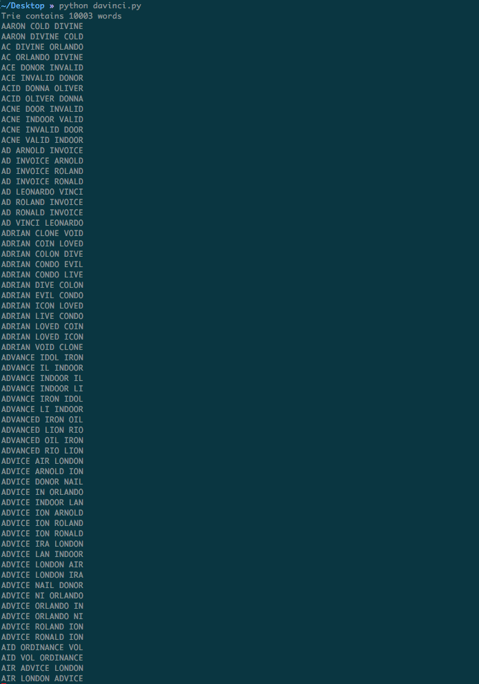
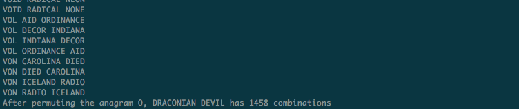
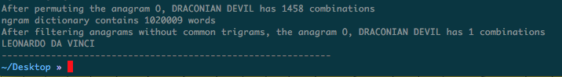
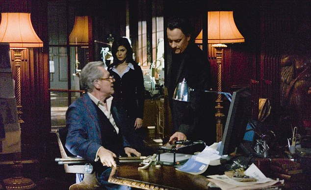

# Cracking the Da Vinci Code with Google interview problems and NLP in python
*Written by Lucas Ou-Yang*


I was rewatching <u>The Da Vinci Code</u> the other day and came across an incredible scene near the start where Robert and Sophie, the two leading protagonists playing detective roles, stumble across an anagram puzzle in the Louvre Museum in Paris. It was a dark night and their lives depended on them cracking the code quickly! Silas, the ruthless Opus Dei Zealot, was out for blood.

Some vocabulary for those who aren't familiar:
> An anagram is a word, phrase, or name formed by rearranging the letters of another word. For example: car => rac. These two words are anagrams of each other.

In the Louvre that night, there was a dying man on the floor and beside him was a seemingly meaningless string of text.


O, DRACONIAN DEVIL!
OH, LAME SAINT

If we looked these two phrases up online, in any encyclopedia or reference manual, nothing meaningful will show up. Robert quickly arrived at the correct conclusion in the movie; that these two phrases were anagrams disguising two hidden and more meaningful phrases. (What likely gave it away is the difference in spelling of OH and O in the two phrases)

For those of us plebs who don't have Ph.Ds in symbology, how can we systematically find out all the meaningful anagrams of a phrase like "O, DRACONIAN DEVIL!"?

Thankfully, we have computers and algorithms to help! Let's tackle this problem step by step:

Disclaimer: For the following algorithm we are assuming that:

- The empty spaces count uniquely as characters in an anagram
- Punctuation marks don't count
- The anagrams are all in English

*It wouldn't be hard to build an algorithm that doesn't need the above assumptions but I omitted that to simplify this post*

A brute-force strategy would be to compute all of the possible permutations of "O DRACONIAN DEVIL" first, and then to examine each one. Because of this text's length of 17 characters, the number of permutations is 17! ~ seventeen factorial equals to about 355 trillion combinations! There is no way a human or small group of computers could even compute the possibilities -- nevertheless find out the correct one. We need something smarter.

Computing all permutations is overkill. For example, a permutation of DEVIL is VLDEI, which is a meaningless word, it's not even valid english! Hence, we can change our permutation algorithm to immediately skip out of a computation once the current word in our phrase isn't a valid english word. We can also use this insight to skip out our computation if our current permutation isn't a prefix of a valid english word.

How do we determine if a word is a valid English prefix or word? We can use a trie data structure holding the top 10,000 most commonly used English words to find prefixes. We can use a hashtable of the same 10,000 words to find valid words. We chose the 10K most common words because we want to keep the size of this trie smaller - A smaller trie means we have a tighter definition for "valid English word" which allows for a more efficient permutation algorithm.

The big O-notation runtime is still O(n!) ~ 17! ~ 355 trillion because the upper-bound is that all permutations are not valid English words and also not valid prefixes. But, in practice / on average this algorithm is much more efficient since I got it to run in ~140 seconds on "O DRACONIAN DEVIL". We produced 1,458 valid permutations, a much more sane number than 355 trillion. With adding printlines we see that with the above heuristics we've skipped 65 million recursive calls! WOW!

Here is an algorithm that enumerates all the sane permutations of "O, DRACONIAN DEVIL!".

```python
import string
import time

TRIE_END = '__end'

INPUT_COMMON_ENGLISH_WORDS = '/Users/lucasou-yang/google-10000-english-usa.txt'
INPUT_TRIGRAMS = '/Users/lucasou-yang/trigrams.txt'


def build_trie():
    with open (INPUT_COMMON_ENGLISH_WORDS, 'r') as english_words:
        data = [line.strip() for line in english_words.readlines()
                if line.strip()]
        root = {}
        for word in data:
            current_dict = root
            for letter in word:
                current_dict = current_dict.setdefault(letter, {})
            current_dict[TRIE_END] = True
        print('Trie contains %s words' % len(data))
        return root


def build_english_dict():
    with open (INPUT_COMMON_ENGLISH_WORDS, 'r') as english_words:
        return set(line.strip() for line in english_words.readlines()
                   if line.strip() and len(line.strip()) > 1)


def find_bigrams(input_list):
    return zip(input_list, input_list[1:])


def is_trie_prefix(trie, word):
    if not word or not word.strip():
        return False

    current_dict = trie
    for letter in word:
        if letter in current_dict:
            current_dict = current_dict[letter]
        else:
            return False
    return True


TRIE = build_trie()
ENGLISH_DICT = build_english_dict()

skipped_recursion = 0


def recurse(input_letters, current_permu, solution, final_len, word_end_index):
    global skipped_recursion
    # current permutation matches original anagram length, see if words
    # qualify as real sentence and dedupe, if valid, add to solution set
    if len(current_permu) == final_len:
        last_word = ''.join(current_permu[word_end_index:])
        candidate_word = ''.join(current_permu)
        if last_word in ENGLISH_DICT and \
                candidate_word not in solution:
            solution = solution.add(candidate_word)
            # print(candidate_word.upper())
        return

    seen_at_start = set()  # dedupe repeated characters in recursive depth
    for idx in range(len(input_letters)):
        cur = input_letters.pop(idx)
        if cur in seen_at_start:
            skipped_recursion += 1
            input_letters.insert(idx, cur)
            continue

        seen_at_start.add(cur)
        current_permu.append(cur)
        # spaces get special treatment since they distinguish words,
        # if a word is not valid english (via trie) we stop recursing
        if cur == ' ':
            # cut off extra space
            candidate_word = ''.join(current_permu[word_end_index:-1])
            if candidate_word not in ENGLISH_DICT: # not is_trie_word(TRIE, candidate_word):
                # don't recurse - recent word chunk not valid
                skipped_recursion += 1
                pass
            else:
                recurse(
                    input_letters,
                    current_permu,
                    solution,
                    final_len,
                    len(current_permu)
                )
        else:
            if is_trie_prefix(TRIE, ''.join(current_permu[word_end_index:])):
                recurse(
                    input_letters,
                    current_permu,
                    solution,
                    final_len,
                    word_end_index
                )
            else:
                # don't recurse - word isn't valid, skip onto next one
                skipped_recursion += 1
                pass

        input_letters.insert(idx, cur)
        current_permu.pop()


def transform(s):
    # remove punctution, make lowercase
    s = s.translate(None, string.punctuation)
    return s.lower()


start = time.time()

# orig_string = 'OH, LAME SAINT'
orig_string = 'O, DRACONIAN DEVIL'
xformed_string = transform(orig_string)
xformed_string = list(xformed_string)

# we sort the input characters so we can dedupe and skip recursive calls
# orig = sorted(xformed_string)
final_anagram_len = len(xformed_string)
solution = set()

recurse(xformed_string, [], solution, final_anagram_len, 0)
print('After permuting the anagram %s has %s combinations' %
    (orig_string, len(solution)))

end = time.time()
print('Time elapsed is %s' % (end - start))
print('We skipped recursive calls %s times' % skipped_recursion)
```

Running the code returns 1,458 unique candidates for the decoded anagram of "O, DRACONIAN DEVIL!".





If Robert and Sophie had all afternoon to examine the 1,458 phrases I guess that would be fine .. but we can do better! How can we now algorithmically extract all the most meaningful candidates from this result set of 1,458 anagrams? It would be nice to narrow the candidate set down to, say < 10 anagrams.

We already know that the existing candidates in the 1,458 anagrams are all valid English words since we've done that filtering previously. So, given that we've applied syntactic filtering now would be a good time to apply semantic filtering. 

How about a strategy that filters out the candidates that have meaningless phrases. Can "VOID NONE RADICAL" or "VON RADIO ICELAND" possibly mean anything? The text isn't valid English once again. The of words "von", "radio", "iceland", "void", and "none" are all real English words but combined they are meaningless.

Several solutions to semantic filtering come up:
- Perform [NLP](https://en.wikipedia.org/wiki/Natural_language_processing) analysis on every phrase, remove all the phrases that aren't in the form of <u>valid English grammar</u>.
- Perform NLP analysis but do it in the form of common [bigram or trigram](https://en.wikipedia.org/wiki/Bigram) filtering, keep the anagrams that are <u>collocated trigrams</u>. *Collocations are expressions of multiple words which commonly co-occur. For example: "New York" or "going to".*
Use [IDF](https://nlp.stanford.edu/IR-book/html/htmledition/inverse-document-frequency-1.html) and keep anagrams which have documents with high IDF scores. (we can't use [TF-IDF](https://en.wikipedia.org/wiki/Tf%E2%80%93idf) since the TF in this case wouldn't make sense, a list of permutations isn't a document).

There are likely other strategies but I ended up implementing #2. It worked amazingly. Here is the code (I loaded into a hashtable the 1 million most common trigrams found in the [Corpus of Contemporary American English](http://corpus.byu.edu/coca/) found on this [website](http://www.ngrams.info/download_coca.asp)). The trigram solution lends itself very well to this problem since our original anagram "O, DRACONIAN DEVIL!" has two spaces and three words - which makes it a trigram. We also don't necessarily need to use trigrams to solve this, bigrams also works.

```python
# orig_string = 'OH, LAME SAINT'
orig_string = 'O, DRACONIAN DEVIL'
transformed_string = transform(orig_string)

orig = sorted(transformed_string)
FINAL_ANAGRAM_LEN = len(orig)
solution = set()

recurse(orig, [], solution, len(orig), 0)
print('After permuting the anagram %s has %s combinations' %
    (orig_string, len(solution)))


common_ngrams_dict = {}
# now we need to build a map of the english language's most common bigrams, common bigrams
# are referred to as collocations - two words that, together, are unusually common in
# english texts. we use this technique to filter out the nonsense anagram combinations
# to a sane number this file has just over 1M trigrams, about 17MB (that's fine)
with open(INPUT_TRIGRAMS, 'r') as ngrams_data:
    clean_lines = [s.strip() for s in ngrams_data.read().splitlines()]
    for line in clean_lines:
        freq, w1, w2, w3 = line.split()
        common_ngrams_dict[(w1, w2, w3)] = int(freq)


print('ngram dictionary contains %s words' % len(common_ngrams_dict))

filtered_solution = []
for anagram in solution:
    trigram = tuple(anagram.split())
    if trigram in common_ngrams_dict:
        filtered_solution.append(anagram)


print('After filtering anagrams without common trigrams, the anagram %s has %s combinations' %
    (orig_string, len(filtered_solution)))


for anagram in filtered_solution:
    print(anagram.upper())
```

Iterating all 1,458 anagram candidates and merely checking if they existed in the most frequent trigrams hashmap yielded exactly one result!!!



LEONARDO DA VINCI is the anagram. The grail puzzle is solved, for now at least! 

"O, DRACONIAN DEVIL" <==> "LEONARDO DA VINCI"

*Robert and Sophie now sprint over to the Mona Lisa in the movie, they move on to the next puzzle!*



